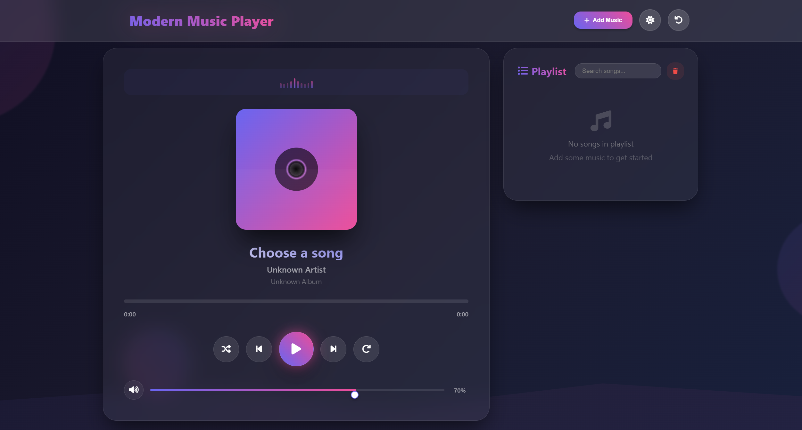
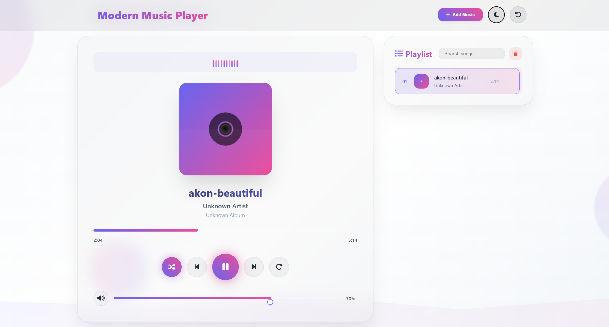
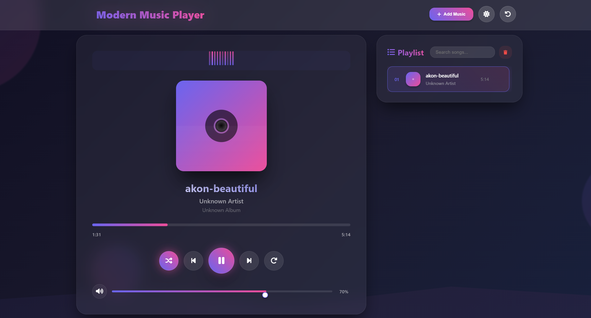

# 🎵 Modern Music Player

A sleek and **responsive music player web app** built with **HTML, CSS, and JavaScript**.  
It features playlist management, an animated audio visualizer, dark/light theme toggle, and full mobile responsiveness.  
Designed to be lightweight, elegant, and easy to use across devices.

---

## 🚀 Live Demo
👉 [View Demo](https://ruvi7599.github.io/music-player/)  
*(Hosted with GitHub Pages)*

---

## ✨ Features

- 🎶 **Playlist Management** – Add, remove, and search tracks easily.  
- 🎼 **Audio Visualizer** – Animated bars that move with your music.  
- 🌗 **Theme Toggle** – Switch between dark and light modes (saved in local storage).  
- 🔊 **Volume Control** – Smooth slider with live percentage display.  
- ⏯️ **Controls** – Play, pause, next, previous, shuffle, and repeat.  
- 📂 **File Upload** – Upload your own songs (drag & drop supported).  
- 💾 **Local Storage Save** – Playlist, volume, and theme preferences are remembered.  
- 📱 **Responsive Design** – Works beautifully on desktop, tablet, and mobile.  

---

## 🖼️ UI Previews

### 🌐 Web View


### 🌗 Light & Dark Modes


### 📱 Mobile Responsive


### 📲 Tablet Responsive


### 🎵 Player Controls


---

## ⚙️ Setup & Usage

1. **Clone this repository**  
   ```bash
   git clone https://github.com/Ruvi7599/music-player.git
   cd music-player
